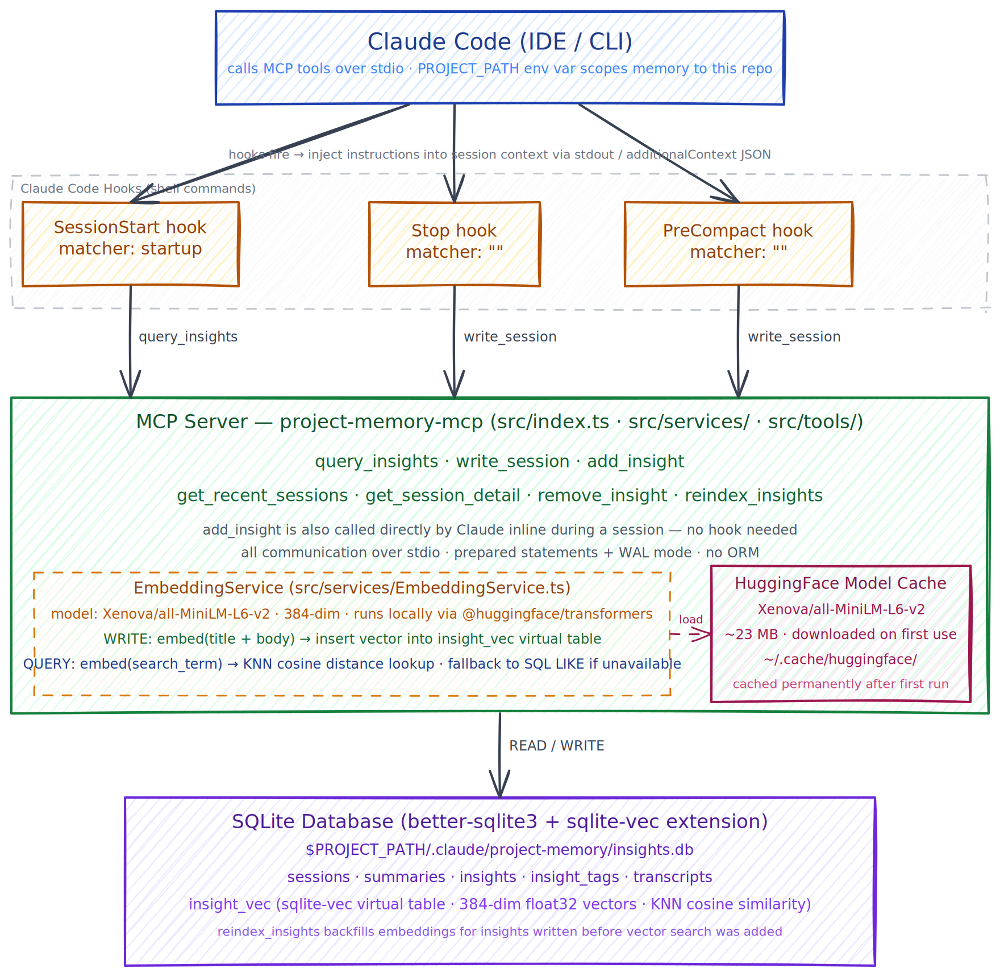

# claude-code-project-memory

A [Model Context Protocol (MCP)](https://modelcontextprotocol.io/) server that gives Claude persistent long-term memory across sessions within the scope of a project. It stores session summaries and structured insights in a local SQLite database, so Claude can recall past decisions, patterns, and mistakes at the start of each new conversation.

## Overview

### Motivation

Claude Code has no memory between sessions. Every conversation starts cold — no recollection of the architectural decisions you made last week, the gotcha you spent two hours debugging, or the pattern that worked well on the last feature. You end up re-explaining context, re-litigating settled decisions, and watching Claude repeat mistakes it already made.

The common workaround is `CLAUDE.md`: a file where developers document architecture, conventions, and guidelines that get loaded into every session. This works for stable, high-level context — but it's a poor fit for the kind of knowledge that accumulates as you build. Learnings are hard to write up as clean markdown in the moment, the file grows unbounded, and everything in it is loaded into every session whether it's relevant or not. A 500-line `CLAUDE.md` covering auth, database patterns, frontend conventions, and deployment quirks all lands in context even when you're just fixing a CSS bug.

This project takes a different approach: insights are captured inline as they happen and stored in a structured, searchable database. At the start of each session Claude calls `query_insights` with filters relevant to the task at hand — pulling only the decisions, patterns, and mistakes that actually apply. The rest stays out of context.

### Benefits

- **Continuity across sessions** — Claude recalls past decisions, patterns, and mistakes without you re-explaining them
- **Inline capture** — insights are saved the moment they happen, not reconstructed from a fading transcript at session end
- **Structured recall** — insights are typed and tagged, so `query_insights` surfaces only what's relevant rather than dumping everything
- **Zero cloud dependency** — memory lives in a local SQLite file inside your project; nothing leaves your machine
- **Low friction** — hooks automate capture and recall; no manual steps required once configured

### Project boundary

This server is deliberately scoped to **one project at a time**. The `PROJECT_PATH` environment variable pins the database to a specific directory, so insights from different codebases never mix.

It does **not**:
- Sync memory across machines or teammates
- Store conversation transcripts by default (opt-in via `write_session`)
- Replace a project wiki or ADR process — it captures what Claude learned, not what humans decided
- Provide cross-project search or a global memory layer (use separate MCP server instances per project)

## Architecture



> Source: [architecture.excalidraw](architecture.excalidraw) — open in [Excalidraw](https://excalidraw.com) to edit.

## How it works

### Writing insights

Insights are written in two ways:

- **End of session** — a stop hook calls `write_session` to persist session metadata (model, duration, token count), a narrative summary and outcome, and any structured insights extracted from the session.
- **Inline during a session** — Claude calls `add_insight` immediately when a decision, pattern, mistake, or learning occurs rather than waiting until the end. If the session record doesn't exist yet, `add_insight` creates it automatically.

Each insight write also generates a **semantic embedding** using the `Xenova/all-MiniLM-L6-v2` model (384-dimensional, runs locally via `@huggingface/transformers`). The embedding encodes the meaning of the insight's title and body and is stored alongside the text in a `sqlite-vec` virtual table (`insight_vec_v2`). Model weights (~23 MB) are downloaded from Hugging Face on first use and cached permanently in `~/.cache/huggingface/`.

### Querying insights

At the start of the next session, Claude calls `query_insights` to surface relevant past context before beginning work.

When a `search` term is provided, `query_insights` first generates an embedding for the query, then runs a K-nearest-neighbour (KNN) lookup against `insight_vec_v2` using vector cosine distance. This returns semantically related insights even when the exact wording differs — for example, searching *"auth flow"* can surface an insight titled *"JWT validation gate added before route handlers"*. Other filters (`type`, `tag`, `project_path`) are applied on top of the KNN results to narrow further.

If the embedding model is unavailable or the vector table is empty, `query_insights` falls back to SQL `LIKE` substring matching automatically. Existing insights written before vector search was added can be backfilled with `reindex_insights`.

## Tools

| Tool | Description |
|------|-------------|
| `write_session` | Persist a completed session with summary and insights. Call from a stop hook. |
| `add_insight` | Add a single insight to a session (auto-creates the session if needed). Use for incremental writes during a session. |
| `remove_insight` | Remove insights by exact ID and/or exact title. At least one must be provided; when both are given both must match. |
| `query_insights` | Search insights by type, tag, project, or semantic free-text. Call at session start to recall past context. |
| `get_recent_sessions` | List recent sessions with summaries and insight counts. |
| `get_session_detail` | Get full detail for a session, including all insights and optionally the transcript. |
| `reindex_insights` | Backfill semantic embeddings for insights written before vector search was added. |

### Insight types

- `decision` — architectural or design choices made
- `pattern` — recurring approaches that worked well
- `mistake` — errors made and how to avoid them
- `blocker` — obstacles encountered and how they were resolved
- `learning` — new knowledge acquired during the session

## Installation

### Prerequisites

- Node.js 20+
- Claude Code CLI

### Plugin install (recommended)

Builds the server and wires all hooks automatically — no manual JSON editing required.

```bash
git clone https://github.com/sukenshah/claude-code-project-memory.git
cd claude-code-project-memory
bash hooks/install.sh
```

Restart Claude Code to activate. To uninstall:

```bash
bash hooks/uninstall.sh
```

Windows:

```powershell
.\hooks\install.ps1
.\hooks\uninstall.ps1   # to uninstall
```

### First-run: hydrate memory for an existing project

After installing, run this prompt in Claude Code from your project's root directory. It scans the codebase and seeds the memory database with insights Claude would otherwise only accumulate session-by-session.

```
Scan this codebase and populate project memory with insights using the project-memory MCP tools.

For each of the following categories, extract concrete, specific insights — not summaries of the README:

- **Patterns** (type: pattern): recurring idioms, conventions, and approaches used consistently across the codebase. Examples: how errors are handled, how tests are structured, naming conventions, how config is loaded.
- **Decisions** (type: decision): architectural or design choices visible in the code. Examples: choice of framework/library, DB schema design, API shape, file organization rationale.
- **Learnings** (type: learning): non-obvious things about the codebase a new contributor would need to know. Examples: gotchas, constraints, why a seemingly-simpler approach wasn't used.

Steps:
1. Explore the repo structure: entry points, key directories, main source files, config files, tests.
2. Read enough code to extract real insights — not surface-level observations.
3. For each insight, call `add_insight` with a specific title, detailed body, and relevant tags.
4. Aim for 10–20 high-signal insights. Skip obvious things derivable from file names alone.

Do not call `write_session` — insights only.
```

This takes 2–5 minutes depending on project size. After it completes, future sessions will start with relevant context already loaded.

### Migrating from manual configuration

If you previously configured this server by hand, remove the old entries **before** running `install.sh` to avoid duplicate MCP servers and double-injected hook instructions.

**1. Remove the old MCP server entry** from `~/.claude/settings.json` (or `.mcp.json`). The key was likely `"project-memory-mcp"` or `"project-memory"`:

```json
"mcpServers": {
  "project-memory-mcp": { ... }   ← delete this entry
}
```

**2. Remove the old hook entries** from `~/.claude/settings.json` (or `.claude/settings.json`). Delete the `SessionStart`, `Stop`, and `PreCompact` blocks that contain `printf`, `jq`, or `project-memory-mcp` in their commands:

```json
"hooks": {
  "SessionStart": [ { "matcher": "startup", "hooks": [ { "command": "jq -n ..." } ] } ],  ← delete
  "Stop":         [ { "matcher": "",        "hooks": [ { "command": "printf 'SESSION END..." } ] } ],  ← delete
  "PreCompact":   [ { "matcher": "",        "hooks": [ { "command": "printf 'PRE-COMPACT..." } ] } ]   ← delete
}
```

Then run `bash hooks/install.sh`.

### Manual setup

<details>
<summary>Manual configuration (advanced)</summary>

1. Clone and build:
   ```bash
   git clone https://github.com/sukenshah/claude-code-project-memory.git
   cd claude-code-project-memory
   npm run build
   ```

2. Register the MCP server in `~/.claude.json`:
   ```json
   {
     "mcpServers": {
       "project-memory": {
         "command": "node",
         "args": ["/absolute/path/to/claude-code-project-memory/dist/index.js"]
       }
     }
   }
   ```

3. Add hooks to `~/.claude/settings.json`:
   ```json
   {
     "hooks": {
       "SessionStart": [
         {
           "matcher": "startup",
           "hooks": [
             {
               "type": "command",
               "command": "node \"/absolute/path/to/claude-code-project-memory/hooks/session-start.js\"",
               "timeout": 10
             }
           ]
         }
       ],
       "UserPromptSubmit": [
         {
           "hooks": [
             {
               "type": "command",
               "command": "node \"/absolute/path/to/claude-code-project-memory/hooks/user-prompt.js\"",
               "timeout": 10
             }
           ]
         }
       ],
       "Stop": [
         {
           "hooks": [
             {
               "type": "command",
               "command": "node \"/absolute/path/to/claude-code-project-memory/hooks/stop.js\"",
               "timeout": 10
             }
           ]
         }
       ],
       "PostCompact": [
         {
           "hooks": [
             {
               "type": "command",
               "command": "node \"/absolute/path/to/claude-code-project-memory/hooks/post-compact.js\"",
               "timeout": 10
             }
           ]
         }
       ]
     }
   }
   ```

</details>

## Database

The SQLite database is stored at:
```
<PROJECT_PATH>/.claude/project-memory/insights.db
```

`PROJECT_PATH` defaults to `process.cwd()` but can be overridden via the `PROJECT_PATH` environment variable. The database directory is created automatically on first run.

## Development

```bash
npm run dev    # run with tsx (no build step)
npm run build  # compile TypeScript to dist/
npm start      # run compiled output
```

## License

MIT — see [LICENSE](LICENSE).
